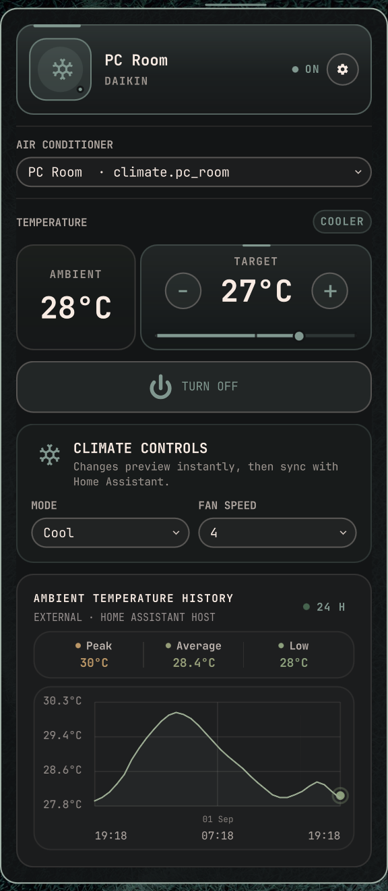
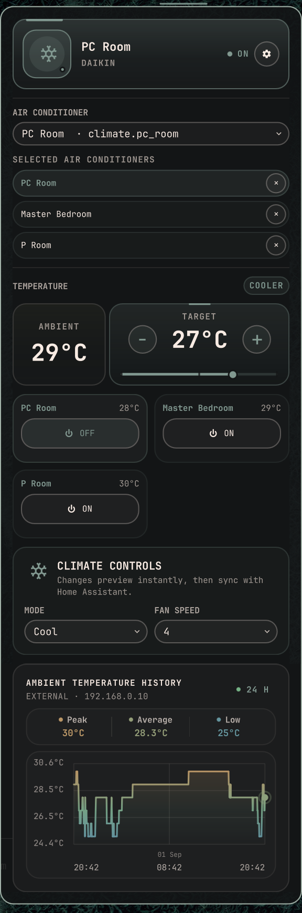

# Daikin AC Controls for Omarchy

Control a Daikin climate device through Home Assistant from the Omarchy bar.
See ambient and target temperature plus power state at a glance, then adjust
temperature, mode, fan speed, and power without opening the Home Assistant
dashboard.

It uses Home Assistant's local REST API. It does not connect directly to the
Daikin cloud or replace Home Assistant's Daikin integration.

## Screenshots

<table>
<tr>
<td align="center" valign="top"><br><sub></sub></td>
<td align="center" valign="top"><br><sub></sub></td>
</tr>
</table>


## Requirements

- Omarchy 4 or newer.
- A Home Assistant server with the Daikin integration configured.

## Daikin compatibility

This plugin controls the `climate.*` entity created by Home Assistant. The
Wi-Fi controller and its firmware matter more than the indoor-unit model alone.
Home Assistant currently lists these supported controller families:

- **Europe:** `BRP069A41`, `BRP069A42`, `BRP069A43`, `BRP069A45`, plus confirmed
  `BRP069B41` and `BRP069B45` controllers using ONECTA.
- **Australia:** `BRP072A42` and `BRP072Cxx`, including Zena devices, using the
  Daikin Mobile Controller.
- **United States:** `BRP072A43` using Daikin Comfort Control.
- **BRP084Cxx:** firmware `2.8.0` or newer.
- **AirBase:** `BRP15B61`.
- **SKYFi:** SKYFi-based units.

Confirmed indoor-unit examples include Cora `FTXM25QVMA`, wall units
`FTXS09LVJU`, `FTXS15LVJU`, and `FTXS18LVJU`, and floor unit `FVXS15NVJU`.
These are examples rather than an exhaustive model list: support still depends
on the controller, firmware, and features exposed by Home Assistant. Some
models do not expose every control, such as fan speed or swing.

Check Home Assistant's [Daikin supported hardware list](https://www.home-assistant.io/integrations/daikin/)
before buying or troubleshooting hardware.

## Install

Review the source, then install from the plugin repository:

```bash
omarchy plugin add https://github.com/twentylines/omarchy-daikin-control.git --enable
```

## First setup

1. Click the Daikin AC Controls widget in the bar.
2. Enter the Home Assistant address, such as
   `http://homeassistant.local:8123`.
3. Paste a long-lived token from **Home Assistant → Profile → Security →
   Long-Lived Access Tokens**.
4. Choose the climate entity when more than one is available.

The token is stored locally in
`~/.config/omarchy/home-assistant-ac.json` with owner-only permissions. It
is sent to the helper through standard input and is not put in command-line
arguments or displayed in the bar.

## What the app does

- Shows the selected AC's ambient temperature, target, and power state in the
  bar.
- Opens controls for target temperature, supported climate modes, fan speeds,
  and power.
- Updates controls immediately while waiting for Home Assistant to confirm the
  requested state.
- Records ambient temperature history locally, with optional external-server
  logging for longer-running history.

## Settings

### Preferences

- **Show climate controls** toggles the mode, fan, and temperature controls.
- **Bar temperatures** chooses ambient, target, or both.
- **Temperature unit** displays Celsius, Fahrenheit, or Kelvin.
- **Ambient temperature chart** controls whether the chart is shown in the
  main panel.
- **History source** chooses **LOCAL** or **EXTERNAL SERVER** for its log.
- **Customisation** appears after enabling **Extra customisations** in
  Experimental, keeping appearance controls together in their own settings
  section.

Local history is recorded while this PC is available. The chart displays a
rolling window ending now: selecting X H shows the past X hours. It keeps up to
31 days. Long recordings are better suited to the external logger.

### Experimental

- **MasterSwitch** is a single guarded power button for every available AC,
  independent of the climate-controls toggle.
- **Multiple air conditioners** adds selected entities below the main
  selector.
- **Globally synced controls** applies shared controls to all selected ACs.
  Separate-remotes mode gives each unit its own controls. The optional
  non-power sync keeps temperature, mode, and fan settings shared while power
  remains individual.
- The bar temperature can show the average, all selected values, one unit, or a
  chosen subset. The main panel keeps the normal ambient-temperature card.
- **Decimal average** controls whether averaged multi-AC values show one decimal;
  it is off by default so the bar stays compact.
- **Extended chart history** adds 7-day, 30-day, and custom ranges up to
  744 hours. An always-on external logger is recommended for long recordings.
- **Extra customisations** enables the dedicated **Customisation** section for
  adjustable panel background, transparency, blur, corner radius, and colour
  controls. The background follows Omarchy by default, or can be set to a
  fixed colour. **Compact UI** removes idle card chrome and tightens spacing
  while preserving readable padding.
- **Config file mode** is enabled from **Experimental**. Once enabled, it
  replaces the settings panes with a keyboard-first JSON editor under the
  **SETTINGS** title, where the mode can be disabled again. Press **Ctrl+S** or
  **Ctrl+Enter** to validate and save, **Ctrl+R** to reload, and use **Tab** or
  **Shift+Tab** to move through the editor actions. Arrow keys, Page Up/Down,
  the mouse wheel, and the editor scrollbar move through longer documents;
  holding the cursor keys follows the document all the way to its top or
  bottom. The saved Home Assistant connection URL and token are never included
  in the document.
- **Global Tab navigation** keeps Tab and Shift+Tab inside this panel and
  moves through its controls instead of switching to another bar panel.
- **Keyboard shortcuts** enables a dedicated **Shortcuts** section where each
  shortcut can be edited or disabled. **Reset shortcuts** restores the defaults.
- With multiple ACs and **Globally synced controls** off, the power shortcut
  followed by **1–9** targets an individual selected AC.

These options are optional and separate from the default single-AC workflow.

### Maintenance

- **Reconfigure** changes the current Home Assistant address, token, or entity.
  When reconnecting to the same address, the token can be left blank to reuse
  the saved token locally.
- **Home Assistant Settings** opens the connected Home Assistant panel.
- **Local Home Assistant** can install or reconfigure an official Home
  Assistant Container on this PC.
- **Reset App** removes this plugin's saved connection, preferences, and local
  history only.
- **Uninstall** offers separate confirmations for plugin-only, app plus
  external logger, or complete plugin-managed cleanup.

## External server history

The external server must be the same host that runs Home Assistant. The logger
discovers every available Home Assistant climate entity through that host's
local API, so an unrelated SSH machine cannot provide the chart history. When
installed, a user-owned systemd timer records while that host is on, including
while this PC sleeps, shuts down, or restarts.

The [External Server History guide](EXTERNAL_SERVER_HISTORY.md) is the complete
setup path. It creates a dedicated key once, loads it into Omarchy's stable
per-user SSH-agent socket, verifies non-interactive SSH, and then walks through
the plugin. A passphrase-protected key stays encrypted on disk; a blank
passphrase is supported but is less secure.

In Preferences, enter the SSH target as `user@host` and put the port in its
separate field. Enter the Home Assistant URL as seen from that host, usually
`http://127.0.0.1:8123`. Choose **CONNECT TO SERVER** for an existing logger;
it verifies SSH and saves the pairing without copying files, sending the token,
or reinstalling the timer. Choose **INSTALL / UPDATE TIMER** only for a
first-time setup or when the remote logger configuration needs changing.
If the chart says **EXTERNAL LOG STALE**, the remote timer is reachable but its
Home Assistant token or logger setup needs updating; use **INSTALL / UPDATE
TIMER** to refresh the server-side configuration.

The installer is intentionally narrow: no sudo, package installation, open
ports, telemetry, or Home Assistant control calls. It creates only the named
user config, history file, service, and timer. The token-bearing config and
history are owner-only.

## Optional local Home Assistant

**Set up locally** runs the official Home Assistant Container image with data
under `~/.local/share/omarchy/homeassistant`. It uses host networking so a
local Daikin integration can discover the AC. After it starts, finish
Home Assistant onboarding, add the Daikin integration, create a token, and
connect the plugin.

The container is not removed by normal plugin removal. **Remove everything**
is the explicit cleanup option for the plugin-managed container and its data;
unrelated Docker resources are left alone.

## Uninstall

The three choices are individually confirmed:

- **Remove everything:** plugin data, external logger, and plugin-managed local
  Home Assistant container/data.
- **Remove app + logger:** plugin data and external logger, but keep local Home
  Assistant.
- **Remove plugin only:** plugin files only; keep data, logger, and Home
  Assistant resources.

External cleanup is safe to repeat and removes only the named logger files and
user systemd units. It does not delete unrelated server or Docker data.

## License

MIT. See [LICENSE](LICENSE).
