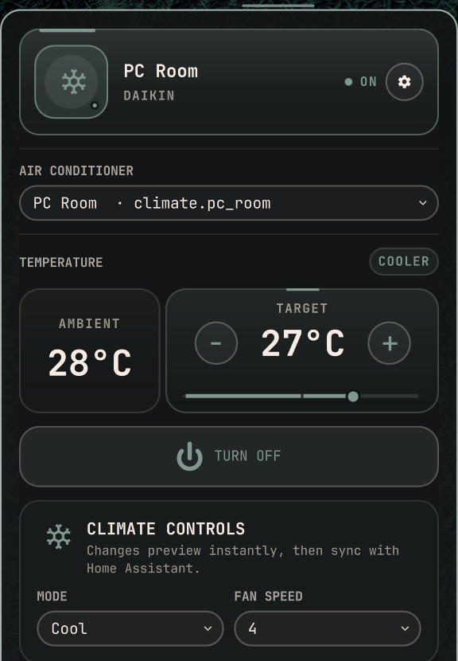
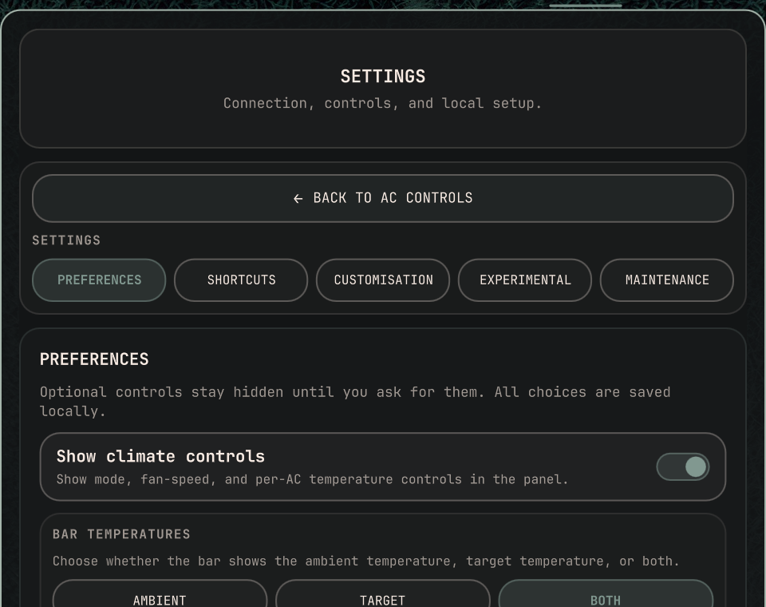
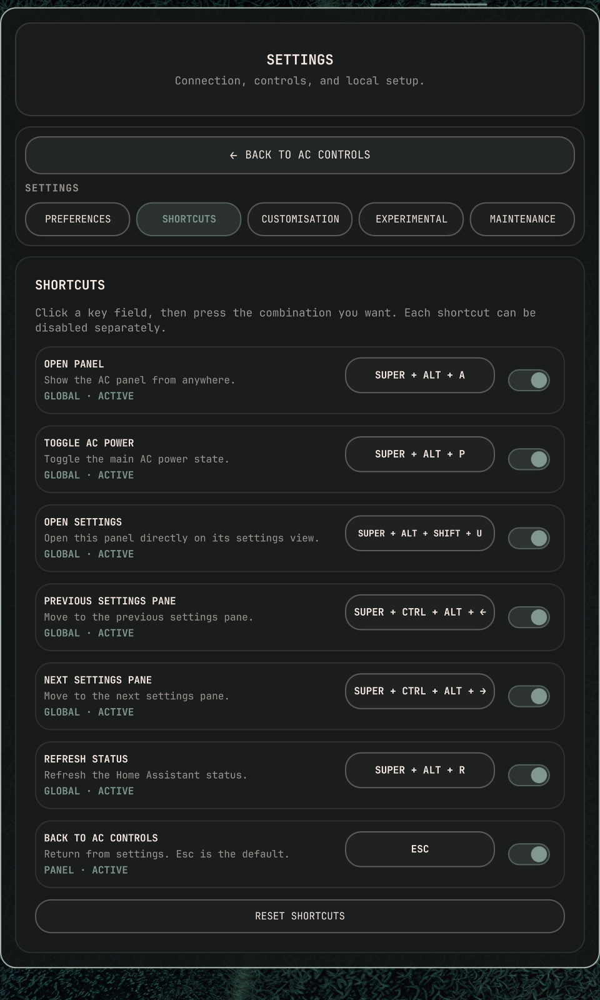
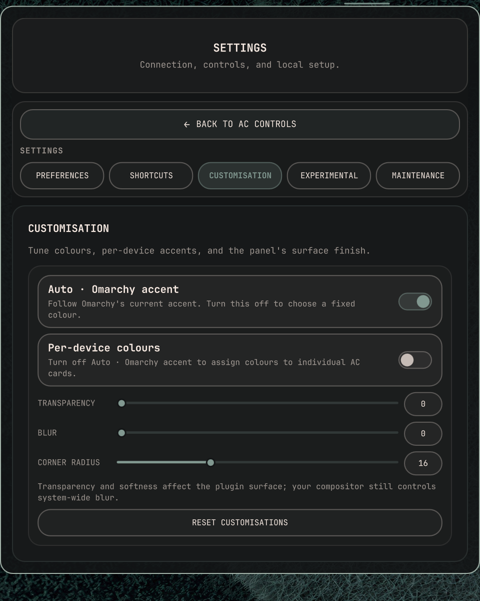
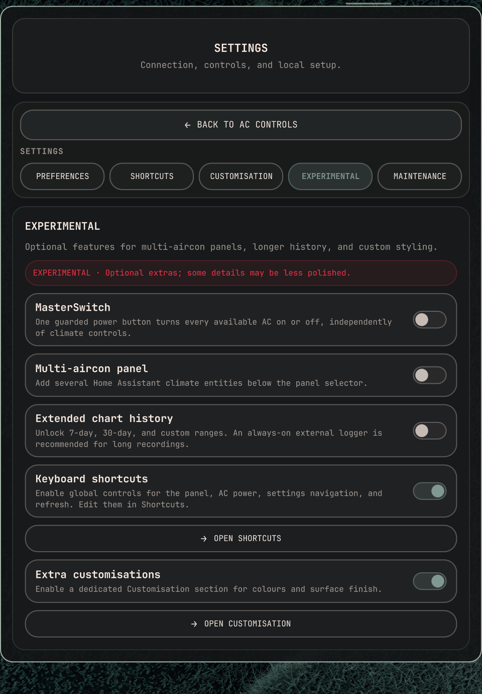
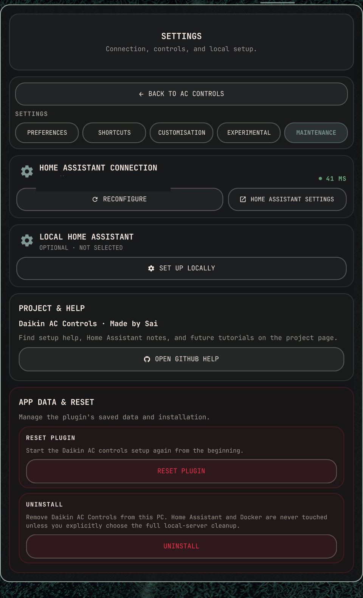

# Omarchy Daikin Control

Control Home Assistant climate devices from the Omarchy bar. The widget shows
ambient and target temperature, power state, and an optional temperature
history chart without opening a Home Assistant dashboard.

It uses Home Assistant's local REST API. It does not connect directly to the
Daikin cloud or replace Home Assistant's Daikin integration.

## Screenshots

Click any tile for the full-size app-only view.

<table>
<tr>
<td align="center"><a href="docs/screenshots/main-controls.png"></a><br><sub>Main controls</sub></td>
<td align="center"><a href="docs/screenshots/preferences.png"></a><br><sub>Preferences</sub></td>
<td align="center"><a href="docs/screenshots/shortcuts.png"></a><br><sub>Shortcuts: ← → ↑ ↓</sub></td>
</tr>
<tr>
<td align="center"><a href="docs/screenshots/customisation.png"></a><br><sub>Customisation</sub></td>
<td align="center"><a href="docs/screenshots/experimental.png"></a><br><sub>Experimental</sub></td>
<td align="center"><a href="docs/screenshots/maintenance.png"></a><br><sub>Maintenance</sub></td>
</tr>
</table>

## Requirements

- Omarchy 4 or newer.
- Home Assistant reachable from this PC.
- A Daikin AC exposed as an available `climate.*` entity by Home Assistant's
  Daikin integration.
- A Home Assistant long-lived access token that can read and control that
  entity.
- `python3`.

Compatibility depends mainly on the Wi-Fi controller and its firmware, not
only the indoor-unit model. Home Assistant's documented examples include
European BRP069A controllers, confirmed BRP069B41/B45 units, Australian
BRP072A42/BRP072C and Zena devices, US BRP072A43, BRP084Cxx on firmware 2.8+,
AirBase BRP15B61, and SKYFi. The Australian BRP072A42 path uses the Daikin
Mobile Controller. Newer cloud-only controllers may not expose the local API.
Check the maintained [Home Assistant Daikin compatibility list](https://www.home-assistant.io/integrations/daikin/)
before buying or troubleshooting hardware.

Optional features have extra requirements:

- **External history:** SSH key access to the same Linux host that runs Home
  Assistant, plus Python 3 and systemd user timers on that host.
- **Local Home Assistant:** Docker and internet access; the setup may ask for
  administrator approval to install or start Docker.

## Install

Review the source, then install from the plugin repository:

```bash
omarchy plugin add https://github.com/twentylines/omarchy-daikin-control.git --enable
```

## First setup

1. Click the Daikin AC Controls widget in the bar.
2. Enter the Home Assistant address, such as
   `http://homeassistant.local:8123`.
3. Paste a long-lived token from **Home Assistant → Profile → Security →
   Long-Lived Access Tokens**.
4. Choose the climate entity when more than one is available.

The token is stored locally in
`~/.config/omarchy/home-assistant-ac.json` with owner-only permissions. It
is sent to the helper through standard input and is not put in command-line
arguments or displayed in the bar.

## What the app does

- Shows the selected AC's ambient temperature, target, and power state in the
  bar.
- Opens controls for target temperature, supported climate modes, and fan
  speeds.
- Updates power controls optimistically while Home Assistant catches up; a
  pending request waits for the desired state and times out cleanly.
- Provides a separately enabled, confirmed **MasterSwitch** for all
  available Home Assistant climate devices.
- Records ambient temperature history locally, or on the external Home
  Assistant host.
- Offers experimental multi-AC controls, longer chart ranges, and appearance
  customisation.

## Settings

### Preferences

- **Show climate controls** toggles the mode, fan, and temperature controls.
- **Bar temperatures** chooses ambient, target, or both.
- **Temperature unit** displays Celsius, Fahrenheit, or Kelvin.
- **Ambient temperature chart** controls whether the chart is shown in the
  main panel.
- **History source** chooses **LOCAL** or **EXTERNAL SERVER** for its log.
- **Customisation** appears after enabling **Extra customisations** in
  Experimental, keeping appearance controls together in their own settings
  section.

Local history is recorded while this PC is available. The chart keeps up to
31 days. Long recordings are better suited to the external logger.

### Experimental

- **MasterSwitch** is a single guarded power button for every available AC,
  independent of the climate-controls toggle.
- **Multiple air conditioners** adds selected entities below the main
  selector.
- **Globally synced controls** applies shared controls to all selected ACs.
  Separate-remotes mode gives each unit its own controls. The optional
  non-power sync keeps temperature, mode, and fan settings shared while power
  remains individual.
- The bar temperature can show the average, all selected values, one unit, or a
  chosen subset. The main panel keeps the normal ambient-temperature card.
- **Decimal average** controls whether averaged multi-AC values show one decimal;
  it is off by default so the bar stays compact.
- **Extended chart history** adds 7-day, 30-day, and custom ranges up to
  744 hours. An always-on external logger is recommended for long recordings.
- **Extra customisations** enables the dedicated **Customisation** section for
  adjustable transparency, blur, corner radius, and colour controls.
- **Keyboard shortcuts** enables a dedicated **Shortcuts** section where each
  shortcut can be edited or disabled. **Reset shortcuts** restores the defaults.
- With multiple ACs and **Globally synced controls** off, the power shortcut
  followed by **1–9** targets an individual selected AC.

Experimental options are optional extras; some details may be less polished.

### Maintenance

- **Reconfigure** changes the current Home Assistant address, token, or entity.
- **Home Assistant Settings** opens the connected Home Assistant panel.
- **Local Home Assistant** can install or reconfigure an official Home
  Assistant Container on this PC.
- **Reset App** removes this plugin's saved connection, preferences, and local
  history only.
- **Uninstall** offers separate confirmations for plugin-only, app plus
  external logger, or complete plugin-managed cleanup.

## External server history

The external server must be the same host that runs Home Assistant. The logger
discovers every available Home Assistant climate entity through that host's
local API, so an unrelated SSH machine cannot provide the chart history. When
installed, a user-owned systemd timer records while that host is on, including
while this PC sleeps, shuts down, or restarts.

The plugin uses SSH key authentication for installation and later history
reads. Set up the key once, select **EXTERNAL SERVER** in Preferences, enter
the SSH target and the Home Assistant URL as seen from that host (usually
`http://127.0.0.1:8123`), then choose **INSTALL SERVER TIMER**.

Read the separate [External Server History guide](EXTERNAL_SERVER_HISTORY.md)
for the one-time key setup, manual installation, review steps, and cleanup.

The installer is intentionally narrow: no sudo, package installation, open
ports, telemetry, or Home Assistant control calls. It creates only the named
user config, history file, service, and timer. The token-bearing config and
history are owner-only.

## Optional local Home Assistant

**Set up locally** runs the official Home Assistant Container image with data
under `~/.local/share/omarchy/homeassistant`. It uses host networking so a
local Daikin integration can discover the AC. After it starts, finish
Home Assistant onboarding, add the Daikin integration, create a token, and
connect the plugin.

The container is not removed by normal plugin removal. **Remove everything**
is the explicit cleanup option for the plugin-managed container and its data;
unrelated Docker resources are left alone.

## Uninstall

The three choices are individually confirmed:

- **Remove everything:** plugin data, external logger, and plugin-managed local
  Home Assistant container/data.
- **Remove app + logger:** plugin data and external logger, but keep local Home
  Assistant.
- **Remove plugin only:** plugin files only; keep data, logger, and Home
  Assistant resources.

External cleanup is safe to repeat and removes only the named logger files and
user systemd units. It does not delete unrelated server or Docker data.

## License

MIT. See [LICENSE](LICENSE).
